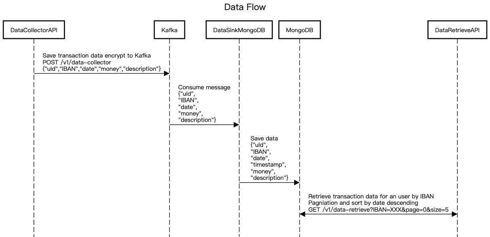

# Synpulse8 Challenge

## Component
```
kafka (v3.2.1)
mongodb (v5.0.15)
data-collector-api (java spring boot microservice)
data-retrieve-api (java spring boot microservice)
data-sink-mongodb (java spring boot microservice)
```

## Init service and environment
```
./restart.sh all
```
#### Please wait for a while because of the kafka first initialization
## Docker containers
| IMAGE                           | PORTS                                                | NAME                |
|---------------------------------|------------------------------------------------------|---------------------|
| docker-dev-data-collector-api   | 0.0.0.0:8080->8080/tcp                               | data-collector-api  |
| docker-dev-data-retrieve-api    | 0.0.0.0:8081->8080/tcp                               | data-retrieve-api   |
| docker-dev-data-sink-mongodb    | 0.0.0.0:8082->8080/tcp                               | data-sink-mongodb   |
| mongo:5.0.15                    | 0.0.0.0:27017->27017/tcp                             | mongo-db            |
| obsidiandynamics/kafdrop:latest | 0.0.0.0:9000->9000/tcp                               | kafdrop             |
| bitnami/kafka:3.2.1             | 0.0.0.0:9091-9092->9091-9092/tcp                     | kafka               |
| bitnami/zookeeper:3.8           | 2888/tcp, 3888/tcp, 0.0.0.0:2181->2181/tcp, 8080/tcp | zookeeper           |

## Rebuild sandbox or other dependency
```
./restart.sh
./restart.sh $dependency
```

## Connect docker-network kafka 
### Using kafdrop: https://hub.docker.com/r/obsidiandynamics/kafdrop
```
./restart.sh kafka
visit http://localhost:9000/ to see admin UI
```

## Dependency list
```
(
  kafka
  mongodb
  sandbox
)
```
## Sequence Diagram


## Database Schema
#### Database name: Customer
#### Collection name: transaction
| Field       | Type   | Description                                | Example                               |
|-------------|--------|--------------------------------------------|---------------------------------------|
| uId         | String | Unique ID                                  | 89d3o179-abcd-465b-o9ee-e2d5f6ofEld46 |
| money       | Object | Transaction money amount with currency     | {"amount": 1220, "currency": "CHF"}   |
| IBAN        | String | Account IBAN                               | CH93-0000-0000-0000-0000-0            |
| date        | String | Transaction date (dd-MM-yyyy)              | 01-10-2020                            |
| timestamp   | Long   | UTC timestamp for date (hidden, sort used) | 1601510400                            |
| description | String | Transaction description                    | Online payment CHF                    |


## Try API
### Insert transaction data
```
curl --request POST 'http://localhost:8080/v1/data-collector' \
--header 'Content-Type: application/json' \
--data-raw '{
    "uId": "89d3o179-abcd-465b-o9ee-e2d5f6ofEld46",
    "IBAN": "CH93-0000-0000-0000-0000-0",
    "date": "11-08-2022",
    "description": "Online payment CHF",
    "money": {
      "amount": 1220,
      "currency": "CHF"
    }
}'
```
### Retrieve transaction data for a specific user by IBAN
#### Pagniation and sort by date descending
#### Default value: page=0, size=10
```
curl --request GET 'http://localhost:8081/v1/data-retrieve?IBAN=CH93-0000-0000-0000-0000-0&page=0&size=5'
```

## Service health check
```
curl http://localhost:{PORT}/actuator/health
curl http://localhost:{PORT}/actuator/health/liveness
curl http://localhost:{PORT}/actuator/health/readiness
```
## Swagger
### data-collector-api
```
http://localhost:8080/swagger-ui/index.html
```
### data-retrieve-api
```
http://localhost:8081/swagger-ui/index.html
```